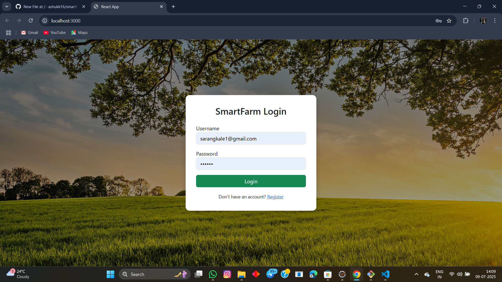
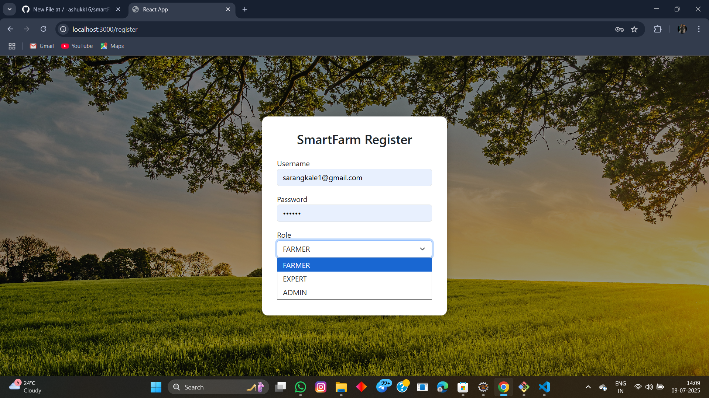
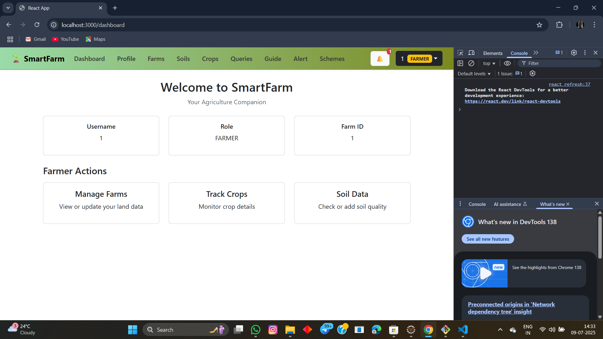
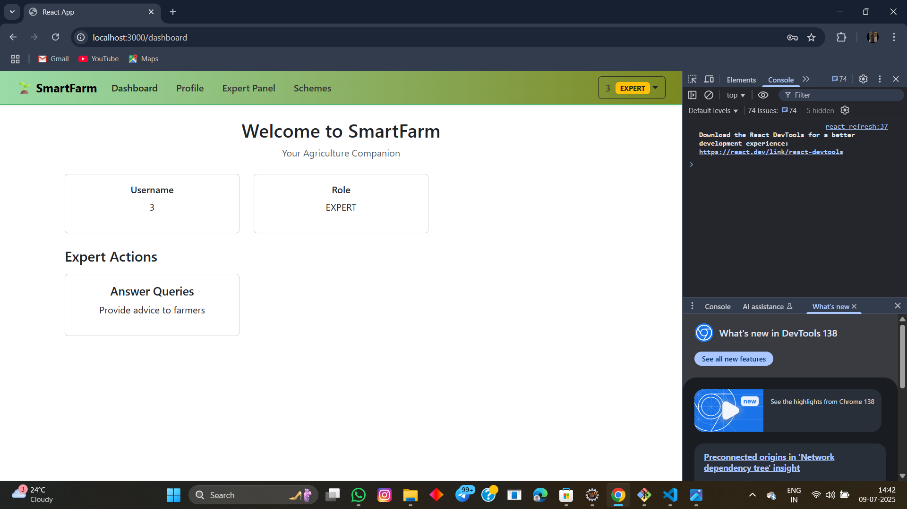
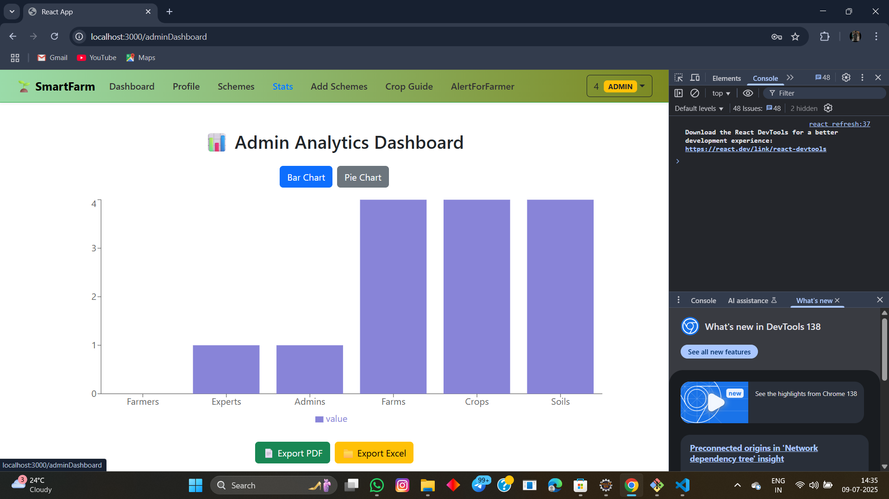

# 🌾 SmartFarm - A Full Stack Agriculture Management System

SmartFarm is a full-stack web application built for farmers, experts, and admins.  
> A modern web application that empowers farmers, agriculture experts, and government admins to manage farms, consult experts, track weather, and access schemes — all in one dashboard.

---

## ✨ Project Highlights

- 🔐 JWT-based Login for three roles – Farmer, Expert, Admin
- 📦 RESTful APIs for managing farms, soils, crops, and queries
- 💬 Expert Advice System – Real-time query and response for farmers
- 🌤  Weather Integration using OpenWeatherMap API
- 📊 Admin Dashboard with analytics, role-wise statistics, and         filterable charts
- 📩 Notifications & Scheme Announcements module
- 💡 Role-based Routing and protected components (React + Spring Security)
- 🚀 Hosted on Vercel (frontend) and Render (backend)

---

## 🚀 Tech Stack

- *Frontend*: React.js + Bootstrap 5  
- *Backend*: Spring Boot (Java)  
- *Authentication*: JWT Token-based login  
- *Database*: MySQL  
- *API Communication*: Axios  

---

## 👥 User Roles and Features

### 👨‍🌾 Farmer
- Register and Login
- Manage Profile
- Add / View Farms, Soil, and Crop data
- Ask queries to Experts
- Receive Alerts & Schemes
- View Weather for Farms

### 🧑‍🔬 Expert
- Login
- View & Answer Farmer Queries

### 🛡 Admin
- Login
- View Dashboard Statistics
- Post Government Schemes
- Send Notifications/Alerts
- Manage Crop Guides

---

## 📸 Screenshots

 
 
  

---

📂 Folder Structure

smartfarmm/
├── backend/                  # Spring Boot backend
│   ├── controller/           # All REST controllers
│   ├── dto/                  # Data Transfer Objects
│   ├── entity/               # JPA Entities
│   ├── repository/           # JPA Repositories
│   ├── service/              # Service Interfaces
│   ├── serviceImpl/          # Service Implementations
│   ├── security/             # JWT Security config
│   └── application.properties
│
├── frontend/                 # React frontend
│   ├── src/
│   │   ├── components/       # React components (navbar, dashboard, etc.)
│   │   ├── CSS/              # Custom stylesheets
│   │   ├── pages/            # Page-level components (Profile, Login, etc.)
│   │   └── api.js            # Axios instance config
│   └── vite.config.js
│
├── screenshots/              # Screenshots for README.md
│   ├── login_page.png
│   ├── register_page.png
│   └── farmer_panel.png
|   └── expert_panel.png
|   └── admin_panel.png
│
└── README.md 

---

💻 How to Run

🟢 Backend (Spring Boot)

cd backend  
./mvnw spring-boot:run  
  
Runs on: http://localhost:8080  
  
  
---  
  
🟣 Frontend (React)  
  
cd smartfarm-frontend  
npm install  
npm run dev  
  
Runs on: http://localhost:3000 
  
  
---  
  
🙋‍♂ Developer Info  
  
Name: Ashutosh Kale  
  
GitHub: ashukk16  
  
Email: ashutoshkale9850@gmail.com  